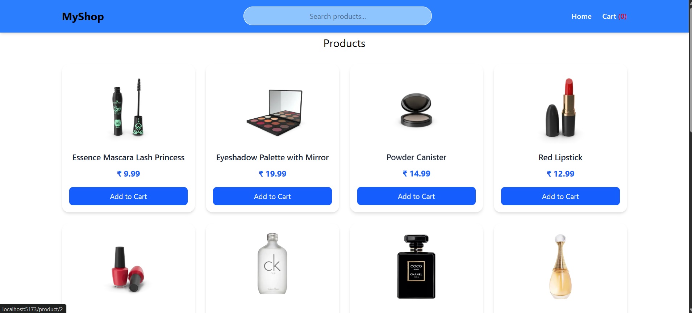
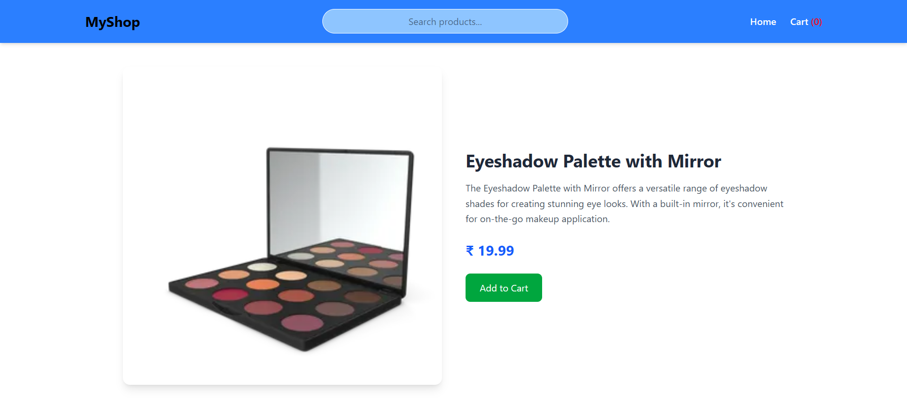
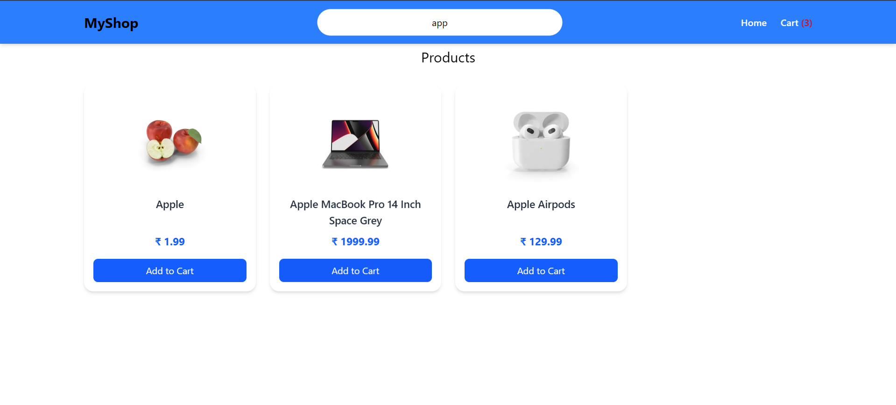
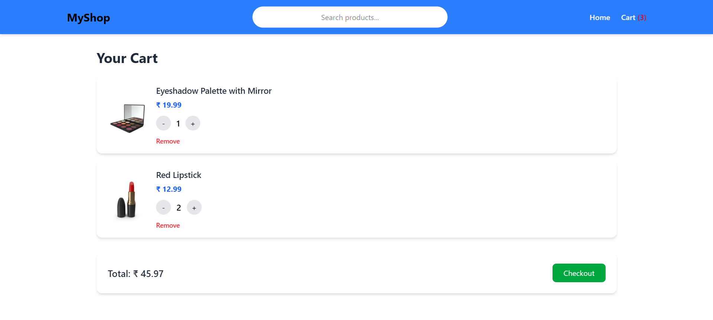

# 🛒 MyShop – E-Commerce React Application






A modern and responsive E-Commerce web application built using **React + Redux Toolkit + React Router + Tailwind CSS**.

🔗 Repository:  
https://github.com/jayesh-shendurnikar-2001/e-commerce.git

---

## 🚀 Features

- 🏠 Home page with product listing
- 🔍 Search functionality (Redux-powered)
- 📄 Product detail page (Dynamic routing)
- 🛒 Add to cart
- ➕ Increase / ➖ Decrease quantity
- ❌ Remove from cart
- 💰 Cart total calculation
- ✅ Checkout page with form validation
- 🎉 Toast notifications for order placement
- 📱 Fully responsive design
- ⚡ Lazy loading & code splitting
- 🔄 Client-side pagination (Load More)
- 🚫 Custom 404 Page

---

## 🛠️ Tech Stack

- **React (Vite)**
- **Redux Toolkit**
- **React Router v6**
- **Tailwind CSS**
- **React Toastify**
- **DummyJSON API** (for product data)

## 📂 Project Structure

```bash
src/
├── app/
│   └── store.js
│
├── components/
│   ├── Header.jsx
│   ├── ProductItem.jsx
│   └── CartItem.jsx
│
├── features/
│   └── cart/
│       ├── cartSlice.js
│       └── cartSelectors.js
│
├── hooks/
│   └── useFetchProducts.js
│
├── pages/
│   ├── Home.jsx
│   ├── ProductList.jsx
│   ├── ProductDetail.jsx
│   ├── Cart.jsx
│   ├── Checkout.jsx
│   └── NotFound.jsx
│
├── routes/
│   └── router.jsx
│
└── main.jsx
```

## ⚙️ Installation & Setup

### 1️⃣ Clone the repository

```bash
git clone https://github.com/jayesh-shendurnikar-2001/e-commerce.git
cd e-commerce
npm install
npm run dev

🧠 Architecture Overview
Redux Toolkit manages cart state globally.
Selectors calculate cart count & total.
React Router handles dynamic routing.
Lazy Loading improves performance.
Custom Hook (useFetchProducts) handles product fetching logic.
Client-side filtering & pagination for better UX.
